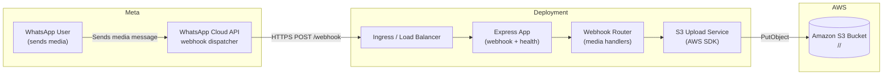

# WhatsApp Cloud API to Amazon S3 Uploader

This project provides a production-ready Express application that listens to WhatsApp Cloud API webhooks and automatically saves any **images**, **videos**, **documents**, or **audio** files sent to your business number into an Amazon S3 bucket. Each sender gets an isolated folder structure to keep uploads organized and easy to audit.

## Features

- ✅ Webhook verification endpoint compatible with Meta's WhatsApp Cloud API.
- ✅ Automatic handling of image, video, document, and audio message types.
- ✅ Media downloads via the Graph API using your app access token.
- ✅ Structured Amazon S3 uploads (`<wa_id>/<media_type>/<filename>`).
- ✅ Centralized configuration with helpful logging to detect misconfiguration early.
- ✅ Health endpoint (`/health`) to simplify uptime monitoring.
- ✅ Optional telephony & engagement module for web-to-mobile calls, call recordings, one-click SMS, and push notifications.

## Prerequisites

- Node.js 16+
- An active WhatsApp Cloud API application with webhook access
- An Amazon S3 bucket and IAM credentials with `s3:PutObject` permission

## Getting Started

1. Install dependencies:

   ```bash
   npm install
   ```

2. Create a `.env` file based on the template below and supply your secrets:

   ```dotenv
   # Server
   PORT=8080
   GRAPH_API_VERSION=v18.0
   VERIFY_TOKEN=your_webhook_verify_token

   # WhatsApp Cloud API
   TOKEN=your_long_lived_access_token

   # Amazon S3
   AWS_S3_BUCKET=your-s3-bucket-name
   AWS_S3_REGION=us-east-1
   AWS_ACCESS_KEY_ID=YOUR_ACCESS_KEY
   AWS_SECRET_ACCESS_KEY=YOUR_SECRET_KEY
   # Optional: store everything under a base prefix such as "production/"
   # AWS_S3_BASE_PREFIX=production

   # Telephony & Engagement (optional)
   TELEPHONY_BASE_URL=https://telephony-provider.example.com/api
   TELEPHONY_API_KEY=your_telephony_provider_api_key
   TELEPHONY_DEFAULT_CALLER_ID=+15551230000
   # Example: set an Indian Airtel caller ID using E.164 format like +919812345678
   TELEPHONY_SMS_SENDER_ID=MyBrand
   TELEPHONY_SIM_SLOT=sim1
   TELEPHONY_STATUS_WEBHOOK_URL=https://your-domain.com/telephony/status
   TELEPHONY_RECORDING_WEBHOOK_URL=https://your-domain.com/telephony/recordings
   TELEPHONY_TIMEOUT=10000
   NOTIFICATION_BASE_URL=https://notifications-provider.example.com/api
   NOTIFICATION_API_KEY=your_push_provider_api_key
   NOTIFICATION_DEFAULT_CHANNEL=general
   # Optional: override the push endpoint relative to the provider base URL
   # NOTIFICATION_PUSH_ENDPOINT=/custom/push
   ```

   > The application still supports the previous variable names (`MYTOKEN`, `S3_AccKEY`, `S3_SecAccKEY`) so existing deployments continue to work.

3. Start the server:

   ```bash
   npm run start
   ```

4. Configure your WhatsApp Cloud API webhook URL in Meta Developer Console to `https://<your-domain>/webhook` and supply the same `VERIFY_TOKEN` value defined in your `.env` file.

## Telephony & Engagement Module

The `telephony` router is an optional, stand-alone component inspired by TeleCRM's autodialer capabilities. When configured, it enables your web application to orchestrate communications that ultimately route through a mobile SIM gateway or CPaaS platform while keeping implementation details out of the UI layer.

### Capabilities

- **Web-to-mobile voice calls:** Trigger outbound calls from the browser to any phone number while leveraging your connected SIM or virtual number. The optional `record` flag enables call recordings when the underlying device or provider supports them.
- **1-click SMS:** Fire off templated or ad-hoc text messages without leaving the workflow your reps already use.
- **Push notifications:** Deliver real-time updates to mobile or desktop clients using your preferred notification provider.

When the telephony provider credentials are absent, the module automatically switches to **simulation mode** so product teams can continue iterating without live telephony infrastructure. Responses include a `simulated: true` flag along with the payload that would have been sent to the provider.

### REST Endpoints

| Method | Path                      | Description |
| ------ | ------------------------- | ----------- |
| GET    | `/telephony/capabilities` | Returns the current module configuration, including simulation mode status and whether recording webhooks are configured. |
| POST   | `/telephony/call`         | Initiates a voice call. Body accepts `to`, optional `from`, `record`, and `metadata`. |
| POST   | `/telephony/sms`          | Sends a one-click SMS. Body accepts `to`, `message`, optional `senderId`, and `metadata`. |
| POST   | `/telephony/push`         | Sends a push notification. Body accepts `to`, `title`, `body`, optional `channel`, and `data`. |

### Example Payloads

```http
POST /telephony/call
Content-Type: application/json

{
  "to": "+15557654321",
  "record": true,
  "metadata": {
    "crmLeadId": "lead-123"
  }
}
```

> 🇮🇳 To test with an Indian Airtel number, update `"to"` to a `+91` number such as `+919812345678` while keeping the E.164 format.

```http
POST /telephony/sms
Content-Type: application/json

{
  "to": "+15557654321",
  "message": "Hi Tina, your order is ready for pickup!"
}
```

```http
POST /telephony/push
Content-Type: application/json

{
  "to": "device-token-abc",
  "title": "New lead assigned",
  "body": "Open the TeleCRM dashboard to review the details.",
  "data": {
    "leadId": "lead-123",
    "priority": "high"
  }
}
```

> 💡 Call the `/telephony/capabilities` endpoint from your UI to toggle functionality automatically when the backend is running in simulation mode.

## Integration Guide

The application can run as an independent webhook listener or be embedded inside a larger platform. Use the steps below to integrate it seamlessly with existing systems.

### 1. Plan Your Deployment Strategy

- **Standalone service:** Deploy this project as its own service when your existing stack is not Node.js-based or when you need isolated scaling. Expose `/webhook` publicly and forward traffic from your ingress or API gateway.
- **Embedded Express router:** For Node.js platforms, mount the provided webhook router inside your current Express app so you can share middleware, authentication, and observability primitives.
- **Serverless container/function:** Package the app into a container image or convert it into a serverless function (e.g., AWS Lambda with an Express adapter) if you prefer event-driven infrastructure. Keep the webhook URL stable for Meta's configuration.

### 2. Align Configuration Management

1. Copy the `.env` template into your configuration store or secrets manager.
2. Provide environment-specific values (tokens, bucket names, AWS regions) for each deployment stage.
3. Standardize variable prefixes (e.g., `WA_WEBHOOK_*`) when integrating into a monorepo to avoid collisions.

### 3. Embed the Router (Optional)

If you plan to integrate directly into an existing Express application:

```js
// In your existing Express server setup
const express = require("express");
const webhookRouter = require("./path/to/whatsapp-Cloudapi-aws-s3/src/routes/webhook");

const app = express();

// Share global middleware as needed
app.use(express.json({ verify: webhookRouter.verifySignature }));
app.use("/webhook", webhookRouter.router);

module.exports = app;
```

Add the health endpoint (`src/routes/health.js`) if your platform depends on liveness checks.

### 4. Configure Infrastructure

1. **Webhook URL:** Publish the `/webhook` path via HTTPS using your load balancer, ingress, or API gateway.
2. **Secret rotation:** Store the WhatsApp Cloud API token and AWS credentials in a secrets manager. Rotate them periodically and redeploy the service.
3. **Observability:** Route logs to your central platform. Enable `DEBUG=true` in lower environments to inspect payloads.
4. **IAM policy:** Confirm that the AWS credentials include `s3:PutObject` (and `s3:PutObjectAcl` when needed) for the target bucket.

### 5. Validate End-to-End

1. Run the webhook verification flow in the Meta Developer Console to confirm the `VERIFY_TOKEN`.
2. Send sample media (images, documents, audio, video) to your business number and verify their presence in S3.
3. Review logs for errors; failures during download or upload provide actionable error messages.

### 6. Operationalize

- Add the service to your CI/CD pipelines so that new commits trigger builds and deployments.
- Configure alerts for repeated webhook failures or S3 upload issues.
- Document the procedure for regenerating tokens or changing S3 destinations.

## Architecture Overview



**Workflow Summary**

1. Customers send media to your WhatsApp business number.
2. Meta's Cloud API delivers webhook payloads to your `/webhook` endpoint.
3. The Express router validates payloads, downloads media via the Graph API, and generates deterministic S3 keys.
4. The AWS SDK uploads content to the configured bucket and folder structure.
5. Health and logging endpoints supply observability data for operators and monitoring systems.

## Folder Structure

Media is stored in S3 using the following pattern:

```
<sending_wa_id>/images/<filename>
<sending_wa_id>/videos/<filename>
<sending_wa_id>/documents/<filename>
<sending_wa_id>/audio/<filename>
```

Filenames are sanitized to avoid invalid characters and the correct file extension is inferred from the media MIME type whenever possible.

## Health Check

A lightweight endpoint is available for uptime monitoring:

```
GET /health -> { "status": "ok" }
```

## Development Notes

- Enable verbose logging by setting `DEBUG=true` before starting the server.
- Errors encountered while processing individual messages are logged but do not interrupt processing of other messages in the same webhook batch.

## License

This project is licensed under the ISC License. See [LICENSE](LICENSE) for more information.
